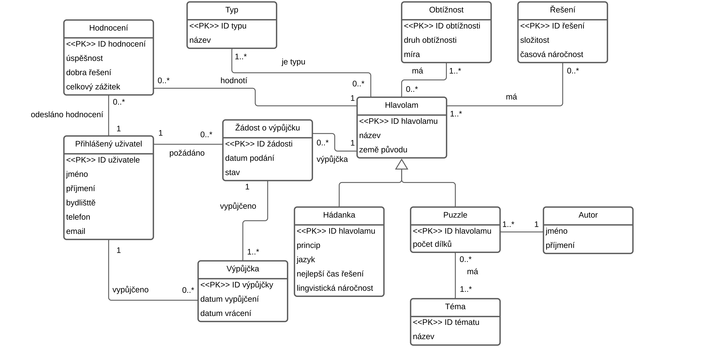
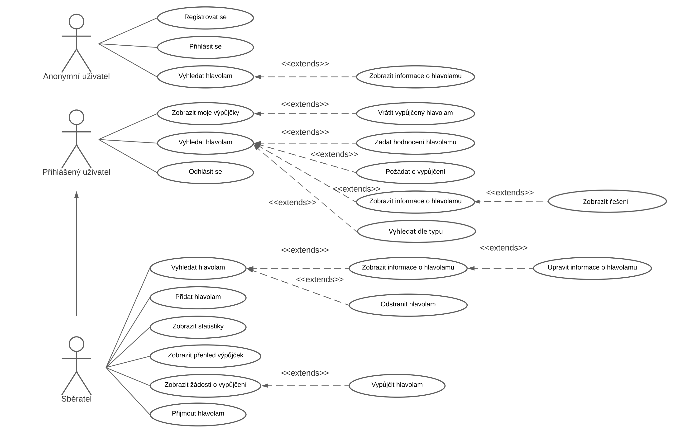
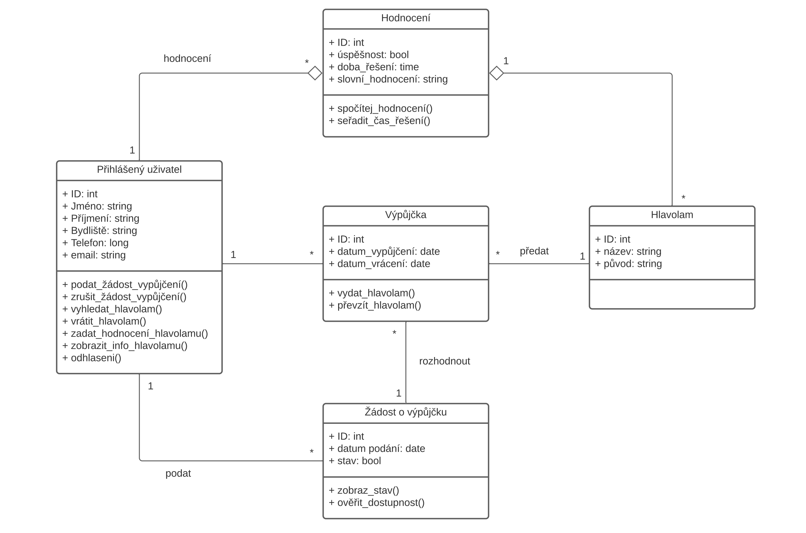
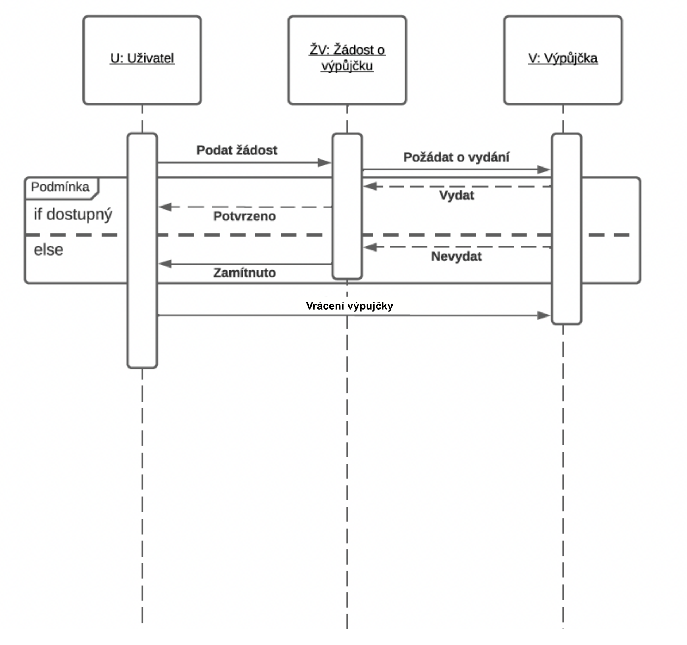
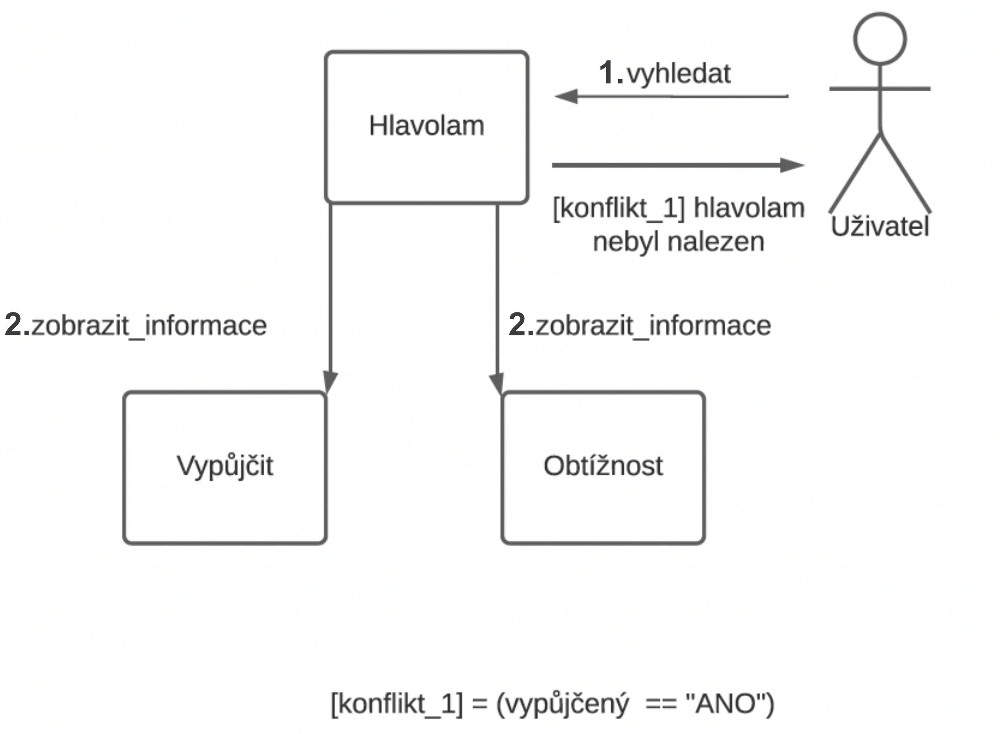

# IDS - Databáze sběratele hlavolamů
## Zadání
Navrhněte databázi, která bude umožňovat vášnivému sběrateli přehledné roztřídění jeho sbírky a následné vyhledávání hlavolamů podle zadaných požadavků. O jednotlivých hlavolamech databáze umožňuje vyhledat jeho typ (dřevěný, železný, plastový, s provázky, puzzle, hádanka, atd.), pojmenování, zemi původu a jeho řešení (některé hlavolamy mohou mít více správných řešení). Každý hlavolam je zařazen do databáze podle své obtížnosti, přičemž obtížnost hlavolamu není pouze číselné ohodnocení, ale obsahuje i informace o různých druzích obtížnosti, jako prostorové, znalostní, časové náročnosti. U hlavolamů typu puzzle je možné dohledat, autora, téma (krajina, portrét, umělecká fotka, mapa, ...), počet dílků. Pokud se jedná o hádanku, sběratel si zapisuje do systému, zda se jedná o logickou hádanku, slovní hříčku, v jakém jazyce je napsána, nejlepší čas řešení, lingvistická náročnost. Sběratel chce umožnit hlavolamy také půjčovat a z toho důvodu mít přehled o tom komu a kdy hlavolam zapůjčil (v případě hádanky pouze komu hádanku poskytl, aby nenabízel stejnou hádanku). Systém mu také nabízí celkovou statistiku o výpůjčkách, oblíbenosti hlavolamů a úspěšnosti jejich řešení vůči počtu zapůjčení a různým obtížnostem hlavolamů.

## Entity Relation Diagram

## Use Case Diagram

## Diagram Tříd

## Sekvenční Diagram

## Diagram Komunikace

